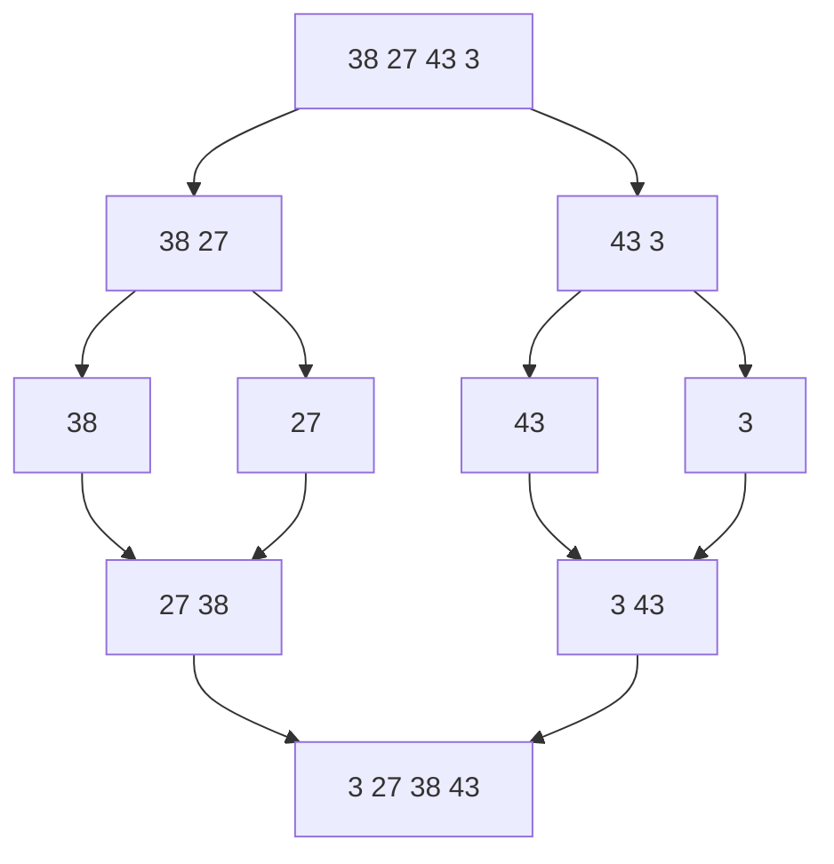
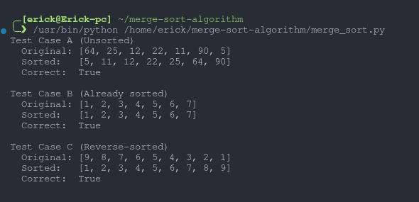
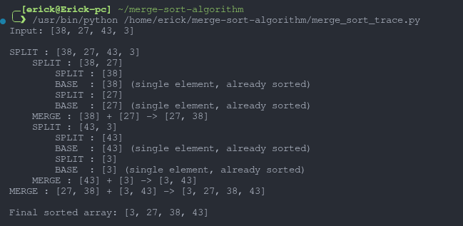

<div align="center">



<br>


-7EE0C3?style=for-the-badge&labelColor=1A1D4A)
-B9A7FF?style=for-the-badge&labelColor=1A1D4A)


</div>

## ✨ What is this?

A clean Python implementation of **Merge Sort**, built with the divide-and-conquer approach, plus:

- 🧪 tests on three kinds of input (unsorted, already sorted, reverse-sorted)
- 🔍 a step-by-step execution trace for `[38, 27, 43, 3]`
- 📈 a short complexity analysis (time and space)

## 🧠 How it works

1. **Divide:** split the array in half at the midpoint.
2. **Conquer:** sort each half recursively. An array of 0 or 1 elements is the **base case**, already sorted.
3. **Combine:** merge the two sorted halves by repeatedly taking the smaller front element.

Here is `[38, 27, 43, 3]` splitting down, then merging back up:



<div align="center">

</div>

## 📁 Project structure

```
merge-sort-algorithm/
├── README.md
├── merge_sort.py            # implementation + the three test cases
├── merge_sort_trace.py      # same algorithm with print-based trace
├── assets/
│   ├── merge-sort-banner.svg      # animated banner
│   ├── merge-sort-thumbnail.png   # static image for the social preview
│   ├── divider.svg                # animated divider
│   └── trace-terminal.svg         # animated terminal replay
├── screenshots/
│   ├── 01-code-annotated.png      # code with base case, divide, merge labelled
│   ├── 02-test-cases.png          # output for cases A, B and C
│   └── 03-execution-trace.png     # trace output, annotated
└── report/
    └── merge-sort-report.pdf      # written report
```

## 🚀 Run it

```bash
git clone https://github.com/pseudohaven/merge-sort-algorithm.git
cd merge-sort-algorithm

python merge_sort.py          # tests: unsorted, sorted, reverse-sorted
python merge_sort_trace.py    # trace for [38, 27, 43, 3]
```

Use `python3` instead of `python` on Mac or Linux. No external packages are needed.

## 🖼️ Output screenshots

### 1. The code

Base case, divide step and merge step are labelled.


### 2. Test cases

| Case | Input type | Original | Sorted |
|:---:|---|---|---|
| A | Unsorted | `[64, 25, 12, 22, 11, 90, 5]` | `[5, 11, 12, 22, 25, 64, 90]` |
| B | Already sorted | `[1, 2, 3, 4, 5, 6, 7]` | `[1, 2, 3, 4, 5, 6, 7]` |
| C | Reverse-sorted | `[9, 8, 7, 6, 5, 4, 3, 2, 1]` | `[1, 2, 3, 4, 5, 6, 7, 8, 9]` |



All three outputs are correct and match Python's built-in `sorted()`.

### 3. Execution trace

An animated replay of the trace first, then the real terminal screenshot:

<div align="center">

</div>



<div align="center">

</div>

## 🧩 The core of it

```python
def merge_sort(arr):
    if len(arr) <= 1:              # base case
        return arr

    mid = len(arr) // 2            # divide
    left = merge_sort(arr[:mid])
    right = merge_sort(arr[mid:])

    return merge(left, right)      # combine
```

## 📈 Complexity

| Case | Time | Space |
|---|:---:|:---:|
| Best | O(n log n) | O(n) |
| Average | O(n log n) | O(n) |
| Worst | O(n log n) | O(n) |

- **Recurrence:** `T(n) = 2T(n/2) + O(n)`. Two half-size subproblems, plus linear work to merge.
- **Why n log n:** halving the array gives about log n levels, and every level does O(n) merging work in total.
- **Why O(n) space:** merging builds new arrays to hold the combined elements, so extra memory grows with the input size.
- **Why every case is the same:** the array is always split in half and every element is always touched during merging, whatever the input order.

<div align="center">


Built by [pseudohaven](https://github.com/pseudohaven)

</div>
